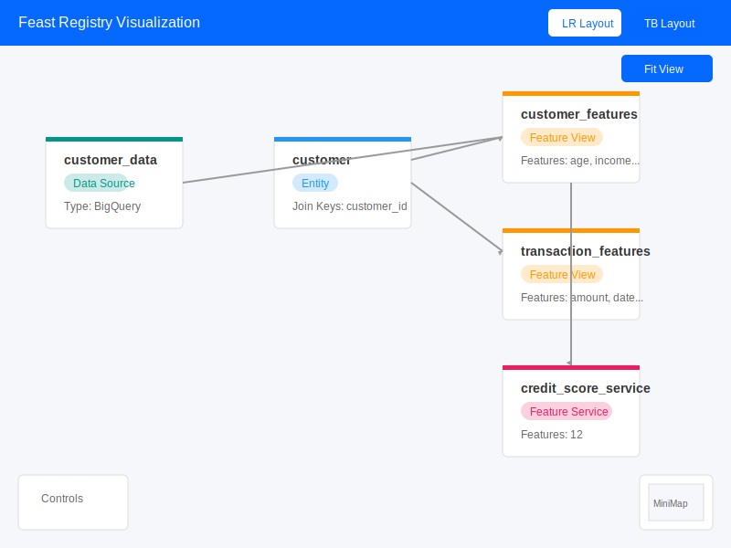
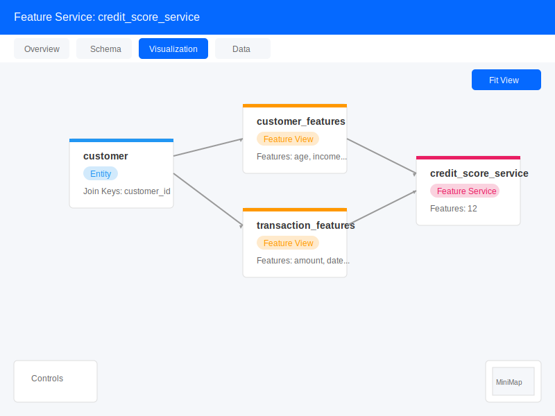
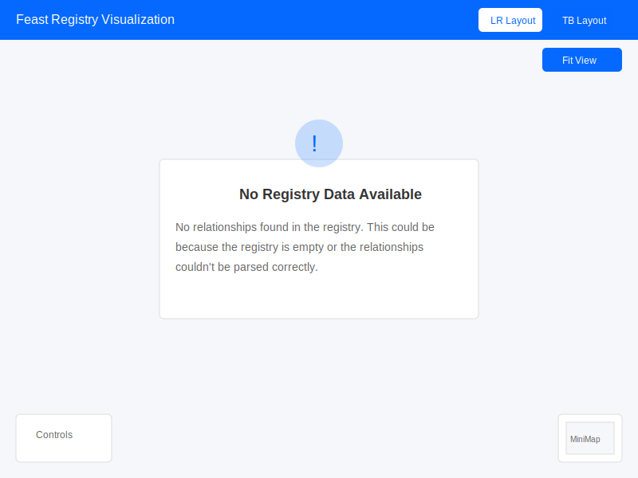

# Feast Registry Visualization

This component provides an interactive visualization of Feast registry metadata and object relationships using ReactFlow.

## Features

- Interactive graph visualization of Feast objects (data sources, entities, feature views, feature services)
- Relationship visualization showing connections between different Feast objects
- Custom node styling for different object types with color coding
- Metadata display for each node type (e.g., features for feature views, join keys for entities)
- Available as both a standalone page and a Feature Service custom tab
- Support for different layout directions (Left-to-Right, Top-to-Bottom)

## Visualization Examples

### Main Visualization Page

### Feature Service Tab

### Empty State

## Implementation Details

### Components

1. **RegistryVisualization**: Main component that renders the ReactFlow graph with nodes and edges
2. **CustomNodes**: Custom node components for different Feast object types
3. **useRegistryVisualization**: Custom hook for extracting and processing registry data

### Data Flow

1. Registry data is loaded using `useLoadRegistry` hook
2. Relationship data is loaded using `useLoadRelationshipsData` hook
3. The `useRegistryVisualization` hook processes this data to create nodes and edges
4. The visualization is rendered using ReactFlow with custom node components

### Integration Points

1. **Feature Service Tab**: Added as a custom tab for Feature Services
2. **Standalone Page**: Available as a standalone page at `/p/:projectName/visualization`
3. **Project Overview**: Link added to the Project Overview page

## Usage

### Viewing the Visualization

1. **From Project Overview**: Click the "View Registry Visualization" button
2. **Direct URL**: Navigate to `/p/:projectName/visualization`
3. **From Feature Service**: Open a Feature Service and select the "Visualization" tab

### Interacting with the Visualization

- **Pan and Zoom**: Use mouse to pan and zoom the visualization
- **Change Layout**: Use the layout direction buttons to switch between layouts
- **View Node Details**: Hover over nodes to see additional metadata
- **Fit View**: Click the "Fit View" button to center the visualization

## Technical Notes

- Uses dagre.js for automatic graph layout
- Custom node types for different Feast object types
- Responsive design that adapts to container size
- Error handling for empty registries or loading failures
